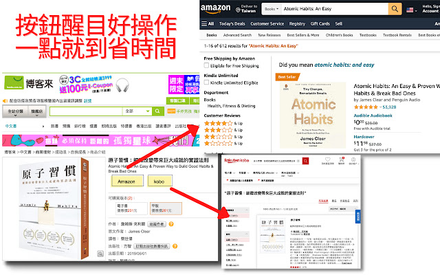
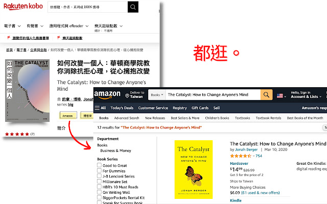

## 在博客來加個 Amazon 的任意門

看到翻譯書都會想要去Amazon再確認一下評價？
透過這個小工具就可以快速增加一個超連結




## 特色

- 按鈕醒目，好操作
- 一點就到，省時間
- 可開可關，好方便
- 提供博客來，kobo，Amazon 快速連結

## 安裝

Step1. 前往 chrome 線上應用程式商店    
Step2. 搜尋 [都逛逛 | 網路書評參考](https://chrome.google.com/webstore/detail/%E9%83%BD%E9%80%9B%E9%80%9B-%E7%B6%B2%E8%B7%AF%E6%9B%B8%E8%A9%95%E5%8F%83%E8%80%83/fjdjfjacahihpfplnmoofhninbpjfaca?hl=zh-TW)

## 開發

Step1. 下載檔案  
Step2. 在 chrome 瀏覽器前往`chrome://extensions/`  
Step3. 將右上角"開啟開發人員模式"打開  
Step4. 點選左上角載入未封裝項目，選擇 src資料夾

## Build

```
rm -rf public.zip
zip -r public.zip src
```

### 參考

[manifest](https://developer.chrome.com/extensions/manifest)  
[favicon.io](https://favicon.io/emoji-favicons/star/)
