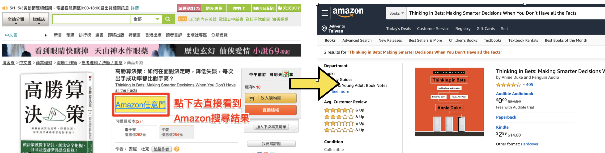

## 在博客來加個Amazon的任意門
有時候在博客來買書，會想要參考Amazon的評價。    
透過這個chrome extensions就可以快速增加一個超連結

## 使用方式
Step1. 下載檔案    
Step2. 在chrome瀏覽器前往`chrome://extensions/`    
Step3. 將右上角"開啟開發人員模式"打開    
Step4. 點選左上角載入未封裝項目，選擇Step1下載的檔案

### 參考
[manifest](https://developer.chrome.com/extensions/manifest)    
[favicon.io](https://favicon.io/emoji-favicons/star/)

## Build
rm -rf public
npx babel scripts --out-dir public/scripts --presets minify
cp manifest.json public/
cp main.css public/
cp -R icon public

zip -r public.zip public

